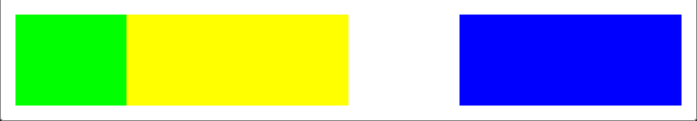

# 044.1 CSS Grid. Позиционирование треков


## [`grid-column`](https://developer.mozilla.org/en-US/docs/Web/CSS/grid-column)

Сокращённое CSS-свойство `grid-column` задаёт размер и положение элемента, находящегося внутри грид-колонки, путём размещения его по грид-линии, расширяя его при необходимости, тем самым определяя начальную и конечную границу грид-области, в пределах которой он должен находиться.

Связанные свойства

### Это свойство является сокращением для следующих свойств CSS:

- `grid-column-end`
- `grid-column-start`

### Syntax

```css
grid-column-start: 1;
grid-column-end: 3;
/* то же самое */
grid-column: 1 / span 2;
/* то же самое */
grid-column: 1 / 3;
```

Это свойство может принимать одно или два значения `<grid-line>`.

Если указаны два значения `<grid-line>`, они разделяются символом "`/`". В этом случае до слеша указывается значение для `grid-column-start`, а после слеша — значение для `grid-column-end`.

Само значение `<grid-line>` может быть определено следующим образом:

- ключевым словом `auto`;
- значением `<custom-ident>`;
- значением `<integer>`;
- `<custom-ident>` и `<integer>`, разделённых пробелом;
- ключевым словом span вместе с `<custom-ident>` или `<integer>`.

### Значения

- `auto`

  Ключевое слово, указывающее, что свойство ничего не делает для размещения элементов, подразумевается автоматическое размещение элемента и занимаемых им колонок, по умолчанию `1`.

- `<custom-ident>`

  Если существует грид-линия с именем в формате `<custom-ident>-start`/`<custom-ident>-end`, элемент будет расположен с начала этой линии.

  Если такой грид-линии нет, то этот значение неявно преобразуется в `<custom-ident>` с числом `1`.

- `<integer> && <custom-ident>?`

      Размещает грид-элемент на грид-линии, заданной числом `<integer>`. Если указано отрицательное число, отсчёт начинается в обратном порядке, начиная с конца грид-раскладки.

      Если в значении задано имя `<custom-ident>`, то будут учитываться линии только с этим именем. Если линий с таким именем не хватает, тогда для поиска нужной позиции будут учитываться неявные грид-линии. То есть эти линии будут учитываться так, как если бы у них было задано указанное имя.

      Целое (`<integer>`) значение `0` считается некорректным.

- `span && [ <integer> || <custom-ident> ]`

  Размещает грид-элемент таким образом, что он будет расширен на указанное число ячеек.

  Если в значении задано имя `<custom-ident>`, то будут учитываться линии только с этим именем. Если линий с таким именем не хватает, тогда для выбора нужного количества ячеек будут учитываться неявно заданные грид-линии. То есть эти линии будут учитываться так, как если бы у них было задано указанное имя.

  Если число `<integer>` не было указано, по умолчанию будет `1`. `Ноль` и `отрицательные числа` считаются недопустимыми.

### Примеры

```html
<div id="grid">
	<div id="item1"></div>
	<div id="item2"></div>
	<div id="item3"></div>
</div>
```

```css
#grid {
	display: grid;
	grid-template-rows: 100px;
	grid-template-columns: repeat(6, 1fr);
	height: 100px;
}

#item1 {
	background-color: lime;
}

#item2 {
	grid-column: 2 / 4;
	background-color: yellow;
}

#item3 {
	grid-column: span 2 / 7;
	background-color: blue;
}
```

Результат:



## [`grid-row`](https://developer.mozilla.org/en-US/docs/Web/CSS/grid-row)

Сокращенное свойство CSS `grid-row` определяет размер и местоположение элемента сетки в ряду сетки, внося линию, span или ничего (автоматическое) для размещения сетки, тем самым указывая встроенный старт и встроенный край его области сетки.

> Синтаксис такой же, как у `grid-column`, но применяется к строкам сетки.

### Syntax

```css
grid-row-start: 1;
grid-row-end: 3;
/* то же самое */
grid-row: 1 / span 2;
/* то же самое */
grid-row: 1 / 3;
```

<hr>

## Ресурсы:

- [Наглядно](https://miro.medium.com/v2/resize:fit:1200/1*il92clGa2OGGpEnkBmRYmQ.jpeg)
- [Документация grid-row](https://developer.mozilla.org/en-US/docs/Web/CSS/grid-row)
- [Документация grid-column](https://developer.mozilla.org/en-US/docs/Web/CSS/grid-column)
- [Код из урока, резервная ссылка](https://drive.google.com/file/d/1FyWfurYeJv4ndi34BFn67s-Db6NO0_FA/view?usp=sharing)
