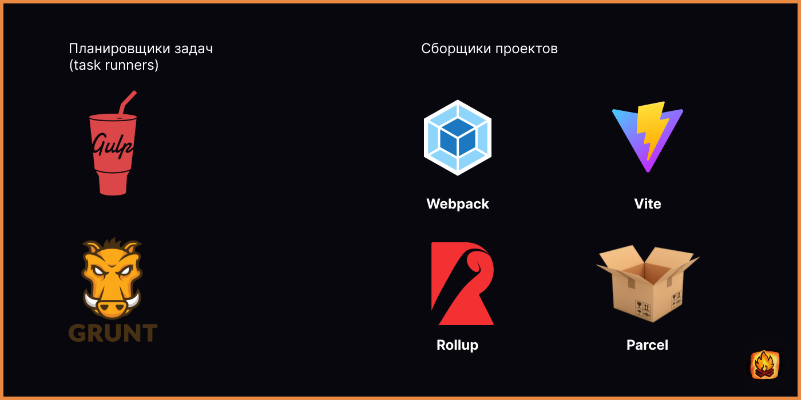

# 068.1 Что такое сборщики проектов, планировщики задач и т.д.



## Введение

В процессе разработки веб-приложений разработчики сталкиваются с множеством рутинных задач, таких как компиляция кода, минификация, оптимизация изображений и многое другое. Для автоматизации этих процессов используются специальные инструменты: **планировщики задач** и **сборщики проектов**. Они помогают ускорить разработку, улучшить производительность приложений и упростить процесс развертывания.

---

## Планировщики задач

### Что это такое?

Планировщики задач — это инструменты, которые автоматизируют выполнение повторяющихся задач. Они позволяют разработчикам сосредоточиться на написании кода, вместо того чтобы вручную выполнять рутинные операции.

### Основные задачи:

- **Компиляция файлов**: Например, преобразование SCSS в CSS.
- **Минификация**: Уменьшение размера JavaScript и CSS для ускорения загрузки.
- **Оптимизация изображений**: Сжатие изображений без потери качества.
- **Запуск локального сервера**: Для тестирования и разработки в реальном времени.
- **Автоматическое обновление браузера**: Перезагрузка страницы при изменении файлов.

### Примеры инструментов:

- **Gulp**:

  - Основан на потоках (streams).
  - Использует JavaScript для создания задач.
  - Простой и гибкий в настройке.
  - Пример задачи на Gulp:

    ```javascript
    const gulp = require('gulp');
    const sass = require('gulp-sass')(require('sass'));

    gulp.task('styles', function () {
    	return gulp
    		.src('src/scss/**/*.scss')
    		.pipe(sass().on('error', sass.logError))
    		.pipe(gulp.dest('dist/css'));
    });
    ```

- **Grunt**:
  - Использует JSON для конфигурации задач.
  - Подходит для проектов с большим количеством задач.
  - Пример конфигурации Grunt:
    ```json
    {
    	"cssmin": {
    		"target": {
    			"files": {
    				"output.css": ["input.css"]
    			}
    		}
    	}
    }
    ```

---

## Сборщики проектов

### Что это такое?

Сборщики проектов объединяют файлы, модули и зависимости в единый оптимизированный пакет, который готов к использованию в браузере. Они также выполняют дополнительные задачи, такие как трансформация кода, разделение на чанки и устранение неиспользуемого кода.

### Основные задачи:

- **Трансформация кода**: Например, использование Babel для преобразования современного JavaScript в старые версии, поддерживаемые браузерами.
- **Объединение файлов**: Слияние нескольких модулей в один файл.
- **Tree-shaking**: Удаление неиспользуемого кода для уменьшения размера итогового файла.
- **Разделение кода**: Создание отдельных чанков для оптимизации загрузки.
- **Оптимизация производительности**: Минификация и сжатие итогового кода.

### Примеры инструментов:

- **WebPack**:

  - Мощный инструмент для сборки модулей.
  - Поддерживает плагины и загрузчики (loaders).
  - Пример конфигурации WebPack:
    ```javascript
    module.exports = {
    	entry: './src/index.js',
    	output: {
    		filename: 'bundle.js',
    		path: __dirname + '/dist',
    	},
    	module: {
    		rules: [
    			{
    				test: /\.css$/,
    				use: ['style-loader', 'css-loader'],
    			},
    		],
    	},
    };
    ```

- **Vite**:

  - Быстрый сборщик с минимальной конфигурацией.
  - Идеален для разработки благодаря встроенному серверу.

- **Rollup**:

  - Ориентирован на создание библиотек.
  - Генерирует минимальный и оптимизированный код.

- **Parcel**:
  - Простое решение с автоматической конфигурацией.
  - Подходит для небольших проектов.

## Почему это важно?

Использование планировщиков задач и сборщиков проектов позволяет:

1. **Сократить время разработки**: Автоматизация рутинных задач освобождает время для работы над функциональностью.
2. **Улучшить производительность приложений**: Оптимизация кода и ресурсов ускоряет загрузку страниц.
3. **Упростить процесс развертывания**: Инструменты создают готовый к использованию пакет, минимизируя ошибки.

<hr>

### Vite

**Vite** — это современный инструмент для сборки фронтенд-приложений, который выделяется своей скоростью и простотой использования. Название "Vite" происходит от французского слова "быстрый", что отражает его основное преимущество — высокая производительность.

#### Основные особенности:

1. **Мгновенный запуск разработки**:

   - Vite использует нативные модули ES (ES Modules), поддерживаемые современными браузерами, что позволяет избежать предварительной сборки проекта.
   - Это обеспечивает практически мгновенный запуск локального сервера, даже для больших проектов.

2. **Горячая перезагрузка (HMR)**:

   - Vite поддерживает быструю перезагрузку модулей (Hot Module Replacement), что позволяет разработчикам видеть изменения в коде практически мгновенно.
   - Это ускоряет процесс разработки и улучшает взаимодействие с приложением.

3. **Минимальная конфигурация**:

   - Vite работает "из коробки" и требует минимальных настроек для начала работы.
   - Однако, при необходимости, его можно легко настроить под конкретные требования проекта.

4. **Поддержка современных технологий**:

   - Vite поддерживает TypeScript, JSX, CSS-модули, PostCSS и другие современные инструменты.
   - Также он интегрируется с популярными фреймворками, такими как Vue, React, Svelte и Preact.

5. **Оптимизация для продакшена**:

   - Для финальной сборки Vite использует **Rollup**, что позволяет создавать оптимизированные и минимизированные файлы для продакшена.
   - Это включает tree-shaking, код-сплиттинг и другие техники оптимизации.

6. **Плагины**:
   - Vite поддерживает систему плагинов, основанную на Rollup, что позволяет расширять его функциональность.
   - Существует множество готовых плагинов для работы с различными технологиями.

#### Пример использования Vite:

1. **Установка**:
   Для начала работы с Vite достаточно установить его через npm или yarn:

   ```bash
   npm create vite@latest my-project
   cd my-project
   npm install
   npm run dev
   ```

2. **Пример конфигурации**:
   Конфигурация Vite задается в файле `vite.config.js`. Вот пример базовой настройки:

   ```javascript
   import { defineConfig } from 'vite';
   import vue from '@vitejs/plugin-vue';

   export default defineConfig({
   	plugins: [vue()],
   	server: {
   		port: 3000,
   	},
   	build: {
   		outDir: 'dist',
   	},
   });
   ```

3. **Запуск локального сервера**:
   После настройки можно запустить сервер разработки:

   ```bash
   npm run dev
   ```

   Это откроет приложение в браузере с горячей перезагрузкой.

4. **Сборка для продакшена**:
   Для создания оптимизированной сборки используется команда:
   ```bash
   npm run build
   ```

#### Преимущества Vite:

- **Скорость**: Благодаря использованию ES-модулей и оптимизированной архитектуре, Vite значительно быстрее традиционных сборщиков, таких как WebPack.
- **Простота**: Минимальная конфигурация позволяет быстро начать работу.
- **Современность**: Поддержка последних стандартов JavaScript и интеграция с популярными фреймворками делают Vite идеальным выбором для современных проектов.
- **Гибкость**: Возможность настройки и использования плагинов позволяет адаптировать Vite под любые нужды.

#### Когда использовать Vite?

Vite идеально подходит для проектов, где важны скорость разработки и простота настройки. Это может быть как небольшой проект, так и крупное приложение, особенно если оно использует современные фреймворки, такие как Vue или React.

#### Ресурсы:

- Официальный сайт: [https://vitejs.dev](https://vitejs.dev)
- Документация: [https://vitejs.dev/guide/](https://vitejs.dev/guide/)

<hr>

## Ресурсы к уроку:

- [Bundlers][1]

[1]: https://att-c.udemycdn.com/2024-12-24_13-24-19-0586457227367157d32230bf97a1e6ed/original.jpg
